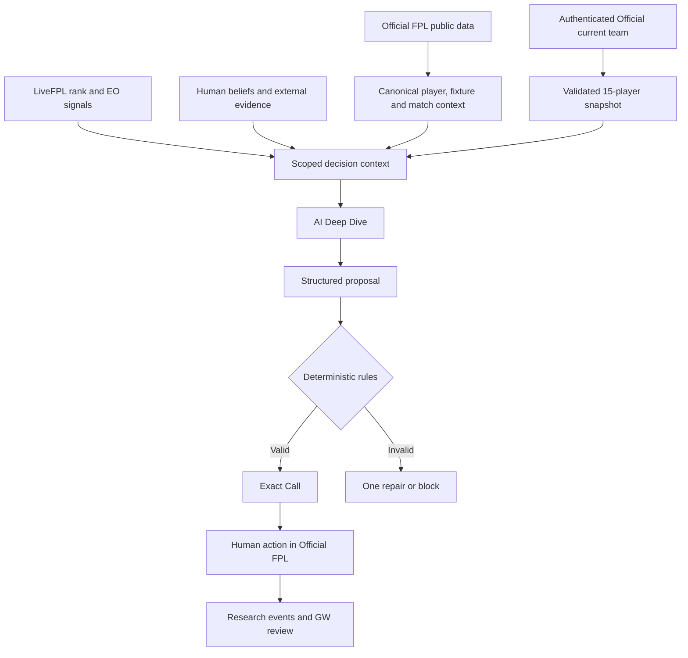

# FPL Decision Engine

### From football data to decisions you can explain.

**Fantasy Premier League · Sports Analytics · Decision Intelligence · Human–AI Research**

A local-first decision-support system that combines **authoritative FPL squad state**, live matchday signals, competitive context, AI-assisted reasoning, and **deterministic legality checks**—then records evidence and outcomes for retrospective analysis.

[Architecture](docs/ARCHITECTURE.md) · [Product case study](docs/PRODUCT_CASE_STUDY.md) · [Decision method](docs/DECISION_ENGINE.md) · [Technical blueprint](docs/TECHNICAL_BLUEPRINT.md) · [Demo walkthrough](docs/DEMO.md)

---

## The question

> Most FPL tools ask: **Who is predicted to score the most points?**
>
> This project asks: **Given the actual squad, free transfers, bank, fixtures, league position, rivals, risk and uncertainty—what decision should the manager make?**

Raw projections are inputs. A useful recommendation also has to respect ownership, the price of making a move, feasible starting XIs, time horizons and what the model actually knows.

### What the system supports

| Decision | Factors considered |
|---|---|
| **Transfer or hold** | Owned players, bank, free transfers, hit cost, fixtures, future flexibility |
| **Captain / vice** | Scoring upside, reliability, projected minutes, ownership/rank context |
| **Starting XI and bench** | Formation legality, expected opportunities, goalkeeper/bench rules |
| **Chips and future planning** | Horizon, squad composition, opportunity cost |
| **Live matchday** | Official locked picks and event-live points, enriched with rank/EO context |
| **Rivals and leagues** | Rank movement and competitive environment, with source and sampling caveats |
| **Decision review** | Evidence, user statements, model recommendations, actions and GW outcomes where reconstructable |

## How it works

**AI proposes. Code validates. The manager decides.** The model never substitutes for Official FPL's account state or lineup rules.

## The engineering decisions that matter

**1. State before advice.** An actionable Exact Call requires a fresh authenticated **current** team—not the last locked squad, a cached copy or a screenshot. Failure to refresh blocks the actionable recommendation.

**2. Structured proposals, not invented lineups.** Deterministic validation enforces 15 unique players, legal transfers and position/club limits, budget checks when supported, 11 starters, legal formation, four-person bench, and a captain/vice pair drawn from starters.

**3. Live points have one official source.** Matchday scoring is based on locked picks × Official FPL event-live player points, less Official transfer cost. LiveFPL enriches projected rank and effective ownership (EO); it does not replace official points.

**4. Small questions should stay small.** A focused captain/bench question gets proportional analysis. Full gameweek planning uses deeper reasoning. Mentioning a league as evidence provenance should not launch unrelated rival research.

**5. Evidence is not ownership.** Screenshots, football observations, news, opinions and hunches retain provenance. Another person's claim is not automatically the user's belief—and neither can rewrite the current squad.

## Built as a living decision laboratory

The longer-term research question is whether football understanding, statistics, intuition, AI influence and competitive context improve **ex-ante decision quality**, not merely whether a lucky pick scored points.

`evidence → belief → recommendation → human response → Official action → outcome → evaluation`

The post-GW5 checkpoint includes five closed gameweeks and approximately **709 research events**. However, its legacy decision ledger contains only two entries, and portions of the historical evidence require reconstruction. Those numbers demonstrate **capture and coverage**, not proved predictive superiority, automated model retraining, or causal AI impact.

Read [Calibration and Outcomes](docs/CALIBRATION_AND_OUTCOMES.md) for research limitations and the planned post-GW5 evaluation.

## Current implementation and release status

| Area | Status |
|---|---|
| Local PowerShell orchestration and browser Control Center | Verified in private V4.1.2 audit |
| Official FPL and authenticated editable current-team integration | Verified implementation; operational authentication requires private local configuration |
| LiveFPL enrichment and Official event-live matchday logic | Verified implementation |
| Deep Dive plus deterministic Exact Call validation | Verified implementation |
| Research event capture and GW archives | Verified in private audit |
| Five-GW normalized decision/outcome analysis and adaptive learning | **Planned V5 work — not claimed complete** |
| Public repository | Documentation and security-policy showcase; curated implementation source is not yet present in this GitHub repository |

The **verified project checkpoint is V4.1.2 (2026/27, post-GW5)**. Do not confuse this historical implementation checkpoint with a completed V5 release.

### Stack

**PowerShell** · **HTML / JavaScript** · **Official Fantasy Premier League APIs** · **LiveFPL enrichment** · **AI reasoning API** · **JSON / JSONL research storage** · **GitHub Actions**

The private local system is not represented here as a plug-and-play hosted service. A published, synthetic-data demo is not yet available.

## Explore the project

| Document | What you'll learn |
|---|---|
| [Product Case Study](docs/PRODUCT_CASE_STUDY.md) | Problem definition, real failure modes, tradeoffs and iteration |
| [Architecture](docs/ARCHITECTURE.md) | Data authority, decision flow and source contracts |
| [Technical Blueprint](docs/TECHNICAL_BLUEPRINT.md) | Runtime, components, storage and system boundaries |
| [Decision Engine](docs/DECISION_ENGINE.md) | Why forecasts alone are not decision value |
| [Function Map](docs/FUNCTION_MAP.md) | Major private-runtime modules and their responsibilities |
| [Calibration and Outcomes](docs/CALIBRATION_AND_OUTCOMES.md) | Human–AI research design, sample limits and future evaluation |
| [Demo Walkthrough](docs/DEMO.md) | The intended end-to-end user journey |
| [Privacy and Public Source](docs/PRIVACY_AND_PUBLIC_SOURCE.md) | What is excluded from publication and why |
| [Building With AI](docs/BUILDING_WITH_AI.md) | Transparent development approach and division of responsibility |

## Development and ownership

Built through **AI-assisted development**, with human-led problem definition, analytics requirements, product/workflow design, validation contracts, source verification, debugging, methodology and release decisions. AI-assisted development is distinct from the AI analysis offered *inside* the product.

This is a decision-intelligence and product-analytics project, not a claim that every source line was typed manually or that every proposed research feature has shipped.

---

Fantasy Premier League and associated product names belong to their respective owners. This is an independent project, not an official Premier League product. No account tokens, personal squad data, private rival histories or raw research archives belong in this public showcase.
