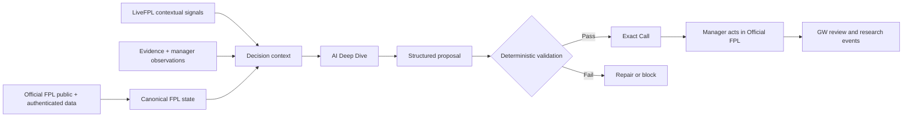

# FPL Decision Engine

**An explainable decision-intelligence system for Fantasy Premier League.**

Most FPL tools focus on who will score the most points. This project asks a different question: **given an actual squad, transfer constraints, live rank and ownership context, uncertainty and human judgment, what should the manager do—and why?**

> **Current verified checkpoint:** V4.1.2 (2026/27 season, after GW5). The planned V5 learning release is **not** represented as complete.

## Architecture

**AI proposes; deterministic code authorizes.** Official FPL remains the source of truth for player IDs, fixtures, owned squad, transfers and points. LiveFPL enriches rank/EO context; screenshots, hunches and social opinions do not establish squad ownership.

## Decisions

- Transfer vs hold, including hit-aware alternatives
- Captain / vice-captain, starting XI and bench order
- Chip and multi-gameweek squad planning
- Rival/mini-league-aware competitive context
- Matchday scores from locked picks × Official event-live player points
- Evidence and decision history for longitudinal evaluation

## Safeguards

An actionable Exact Call requires a fresh authenticated current-team snapshot. Deterministic checks cover 15 unique players, legal transfers, budget, position/club limits, 11 starters, legal formation, bench goalkeeper/order, and distinct starting captain/vice. Invalid proposals are repaired once or blocked. Cached squads and screenshots cannot authorize an Exact Call.

## Research: what is and isn't demonstrated

The checkpoint audit records GW1–GW5 archives and **709 research events**, but the historical decision ledger contains only **two** rows. The event stream and archives support research reconstruction, **not** a defensible claim of automated learning, causal uplift or demonstrated prediction superiority. A post-GW5 normalization and evaluation release is planned.

## Public source status

This repository is initially a **private staging area** for a curated source showcase. The private runtime includes account credentials, personal history, rival/league observations and research data which must never be published. The full sanitized package has been prepared separately; publishing source into this repository is an additional step, and this staging branch does not pretend to contain the complete package.

See [architecture](docs/ARCHITECTURE.md), [decision method](docs/DECISION_ENGINE.md), [research integrity](docs/CALIBRATION_AND_OUTCOMES.md), [privacy](docs/PRIVACY_AND_PUBLIC_SOURCE.md), and [AI-assisted development](docs/BUILDING_WITH_AI.md).

**Development ownership:** AI-assisted implementation, with human-led problem definition, product and analytics requirements, decision safeguards, data-source contracts, methodology, debugging, testing and iteration.
